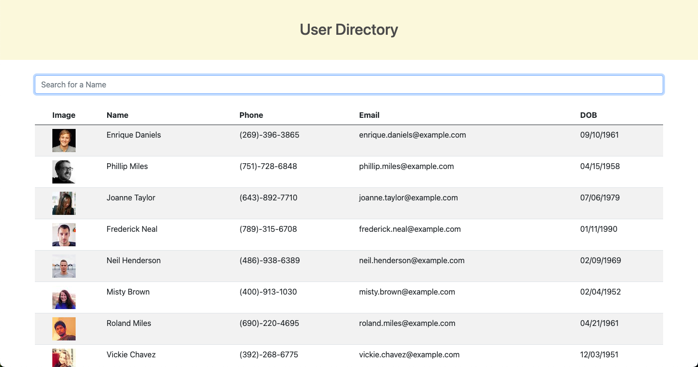

# User Directory

## Table of Contents
  
1. [Description](#description)
2. [Installation](#installation)
3. [Usage](#usage)

[License](#license)

### Description
This application is used to search and order a list of users within a directory. You can click on "Name" to sort the users alphabetically. 
  
### Installation
1) npm i 2) npm start
  
### Usage
This application is used to will be used to search and order a list alphabetically within a directory. 

  
### Questions

If you have any question you can reach me by: 

GitHub: www.github.com/paytoncali

Email Address: paytoncaliw@gmail.com

### Deployment
https://github.com/paytoncali/user-directory.git
https://paytoncali.github.io/user-directory/

### License
This application is covered by MIT

